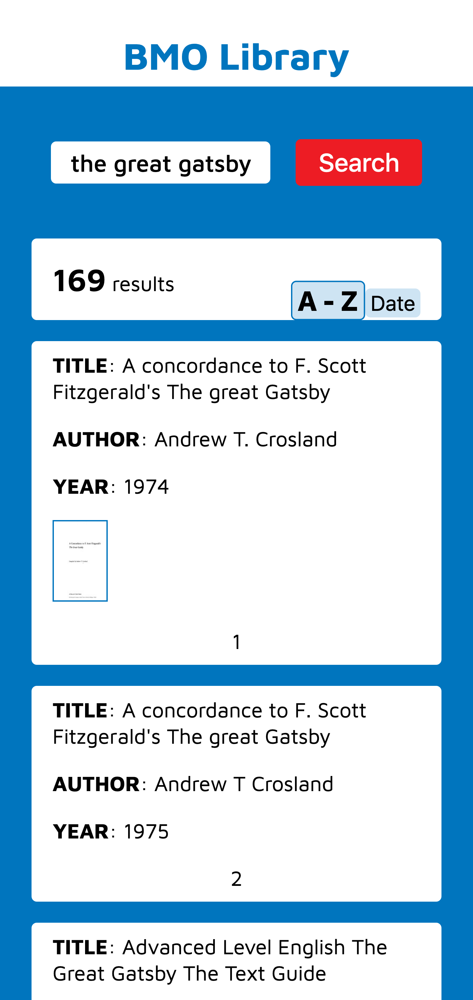
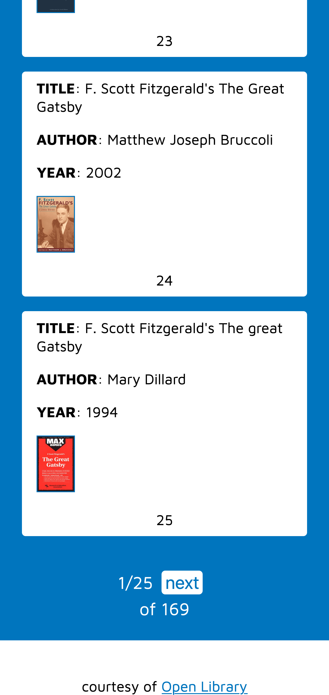
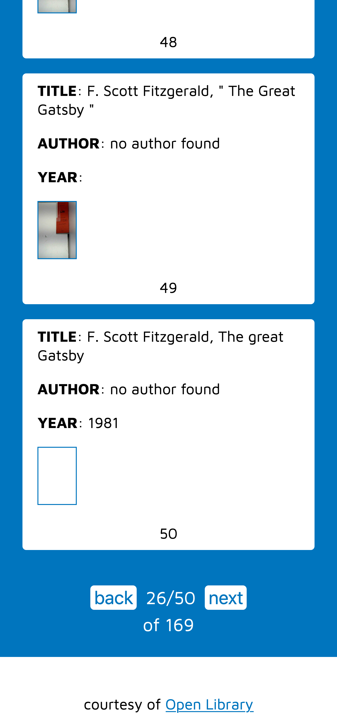
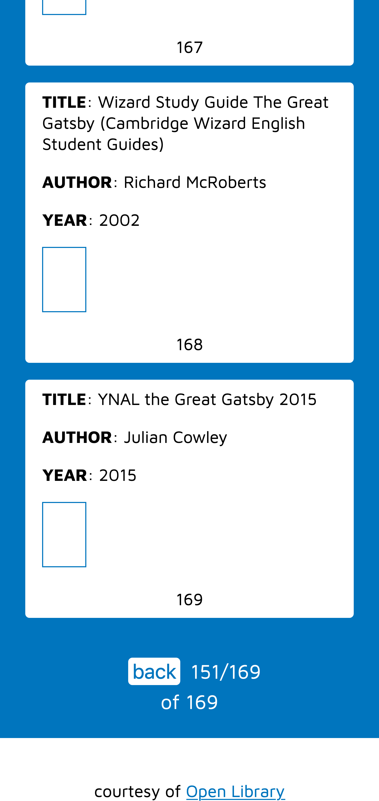
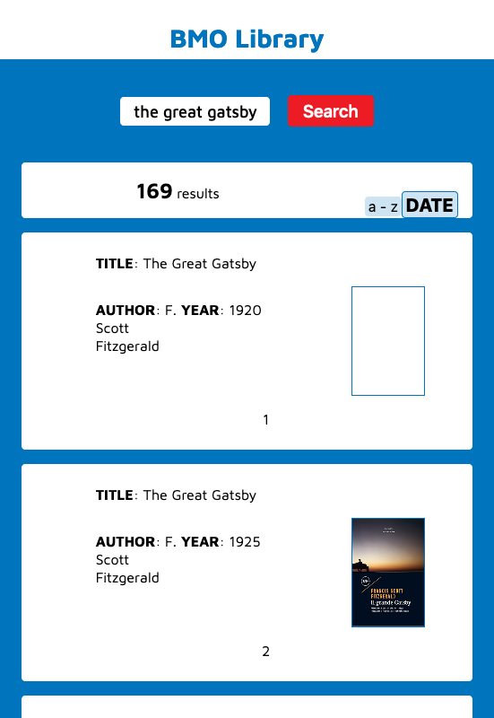
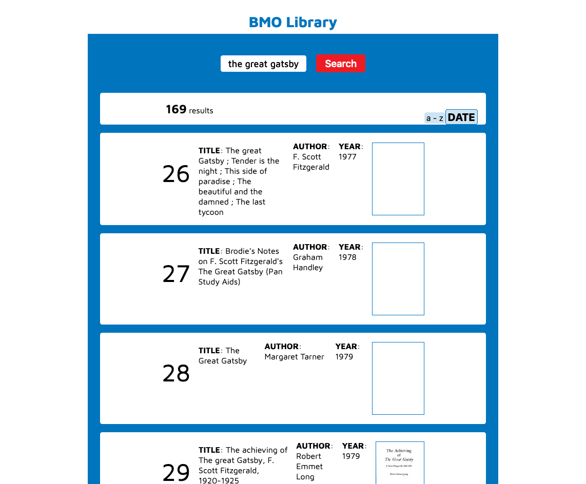

# BMO Frontend Assignment - (Open Lib - API)

## Table of contents

- [Overview](#overview)
  - [The challenge](#the-challenge)
  - [Screenshot](#screenshot)
  - [Links](#links)
- [My process](#my-process)
  - [Built with](#built-with)
  - [What I learned](#what-i-learned)
  - [Continued development](#continued-development)
  - [Useful resources](#useful-resources)
- [Author](#author)
- [Acknowledgments](#acknowledgments)


## Overview

### The challenge

The task is to create an application that accepts a title as a parameter. The application should then return book results, and for each book should display the following information:
- Title
- Book Cover
- Author
- Published Date
The application should also have the ability to:
- Sort results alphabetically by title
- Sort results by more recently published
- Any other functionality you feel will make this app a better experience

### Screenshot

<div>
  <p>Examples of pagination/search results display</p>




  </div>
<p>At 550px width, display changes to grid</p>

<p>At 750px width, display changes to flex with different order</p>


### Links

- Solution Github URL: [https://github.com/Rod-Barbosa/BMOLib](https://github.com/Rod-Barbosa/BMOLib)
- Live Site URL: [https://rodrigo-bmo-lib.netlify.app/](https://rodrigo-bmo-lib.netlify.app/)

## My process

### Built with

- React
- Jest
- React Hooks
- CSS BEM

### What I learned

Fetch functions can be easily tested with axios, as long as you get the expect.assertions(num) correctly
```Jest
const { default: axios } = require("axios");
const functions = {

    fetchUser: () => axios.get(`https://openlibrary.org/search.json?title=the%20great%20gatsby&limit=200`)
        .then(res => res.data)
        .catch(err => 'error'),
```
```Jest
test(`Calling the great gatsby should return 169 docs`, ()=>{
    expect.assertions(1)
    return functions.fetchUser()
        .then(data => {
            expect(data.numFound).toBe(169)
        })
})
```

Dynamically adding/removing classes in react can be clearly demonstrated with CSS BEM naming convention
```React
<button className={`searchDisplay__button${view[0]==="alphabetical" ? "--selected" : ""}`} onClick={alphabeticalOrder}>a - z</button>
<button className={`searchDisplay__button${view[0]!=="alphabetical" ? "--selected" : ""}`} onClick={dateOrder}>Date</button>
```

useEffect Hook can be combined with with a controlled component, so it will only make an API call once the user presses the search button with a valid value on the text input. By making the dependencies array watch a third piece of state, I can set up for both pagination (display only 25 results on the screen) and sort (alphabetical or published year).
```React Hooks
    React.useEffect(()=>{
        if(userInput!==""){
            fetch(`https://openlibrary.org/search.json?title=${userInput}&limit=200`)
            .then(res => res.json())
            .then(data => {
                console.log(data)
                const booksArr = []
                populateBoksArray(booksArr, data)
                
                setFoundData({
                    numFound: data.numFound,
                    booksArr: booksArr
                })
            })
        }
            // console.log(foundData)
    }, [view])
```

### Continued development

This needs more than just 2 days of work. Typography is all over the place. CSS could use refactoring. Alignments of different media queries is unpolished to say the least. A buy button, security checks, a reset function and better treatment to initial screen are all obvious improvements that could be achieved with 1~2 weeks of work. Also, no icons were used (easier accessibility compliance).

### Useful resources

- [CSS Convention](http://getbem.com/naming/) - Good for team work
- [Button or Link, acessibility](https://ux.iu.edu/writings/buttons-vs-links-basic/) - Easy to remember guide on how not to drop that ball
- [Dynamic add/remove class React](https://www.andreasreiterer.at/dynamically-add-classes/) - Looks impossible at first glance, but it is obvious after you get the order of the ticks and scape characters

## Author

- Website - [Rodrigo Portfolio](https://www.gelatodigital.com)
- Frontend Mentor - [@Rod-Barbosa](https://www.frontendmentor.io/profile/Rod-Barbosa)
- Github - [@Rod-Barbosa](https://github.com/Rod-Barbosa)

## Acknowledgments

